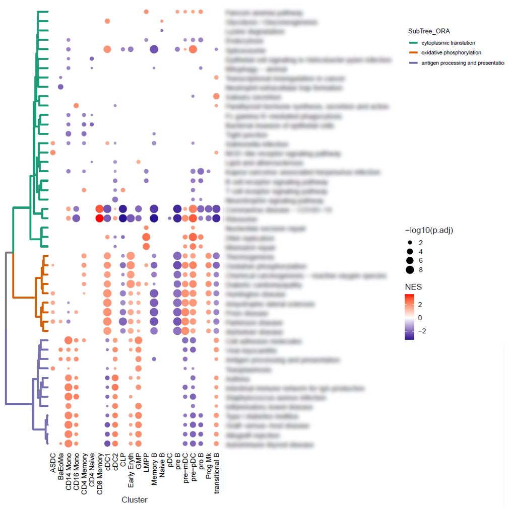
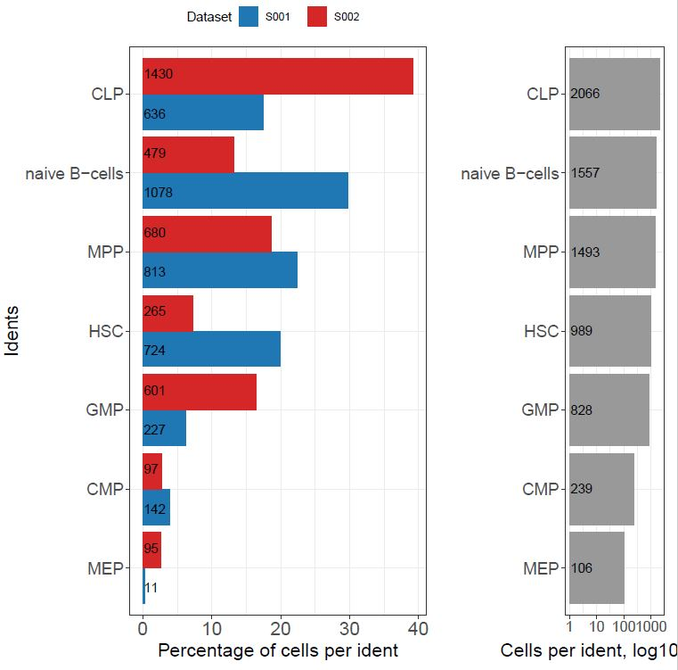
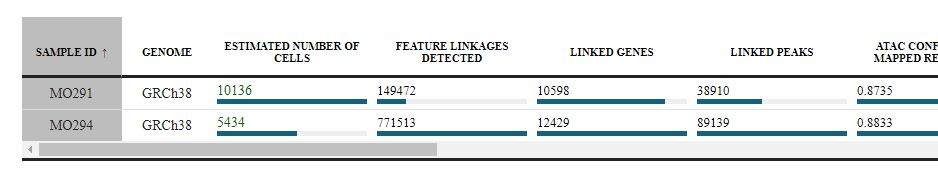
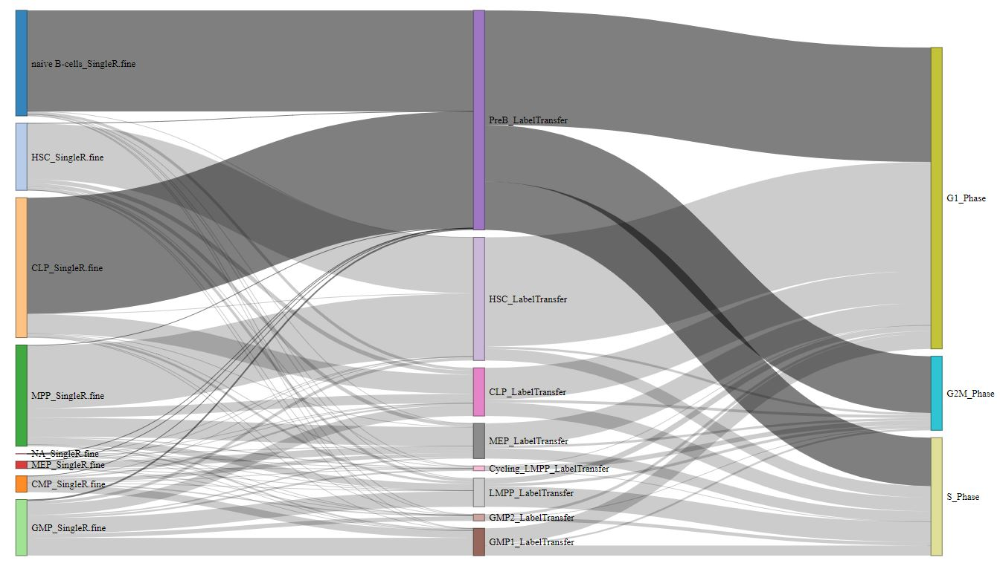
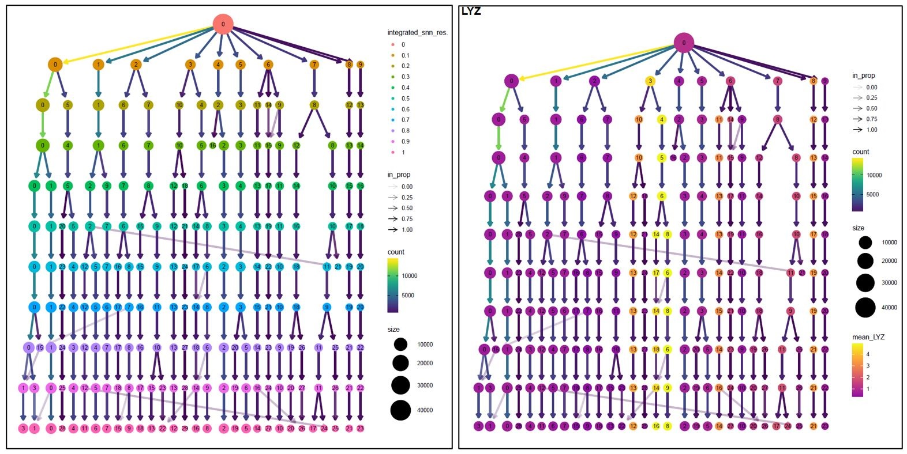

# scNextPlot

## Indtrudaction

scNextPlot is a GitHub package designed to facilitate data visualization, with a specific focus on single-cell data. This package provides a user-friendly approach to presenting information related to a specific biological question in a clear and concise manner. Its objective is to offer a quick and simple overview of complex data sets. With scNextPlot, researchers can simplify their analysis and gain a better understanding of the underlying biological processes at work.

## Installation

To install the GitHub package, you may find the following useful:

    library(devtools)
    install_github("damouzo/scNextPlot")

## What you'll find here
# TreeDot for multiple GSEAs

# Proportions Analysis for Seurat Object 

# Interactive Table for CellRanger Summary

# Sankey Plot for Seurat Object

# Resolusion Check for Seurat Object

